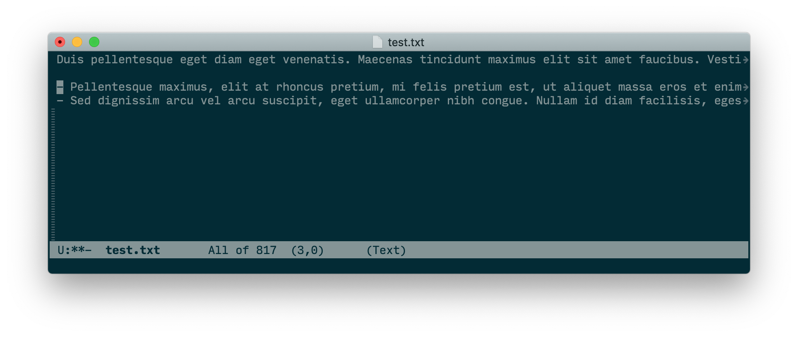
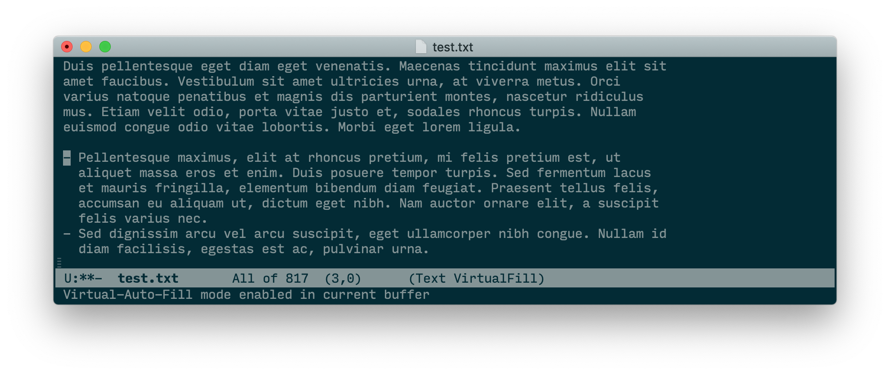

# virtual-auto-fill

`virtual-auto-fill` is an [Emacs Lisp Package](https://www.gnu.org/software/emacs/manual/html_node/emacs/Packages.html) to display unfilled text in a readable way.  It wraps the text as if you had inserted line breaks (e.g. using [`fill-paragraph`](https://www.gnu.org/software/emacs/manual/html_node/emacs/Fill-Commands.html) or `auto-fill-mode`) without actually modifying the underlying buffer.  It also indents paragraphs in bullet lists properly.

Internally, [Adaptive Wrap Prefix mode](http://elpa.gnu.org/packages/adaptive-wrap.html) mode, [Visual Fill Column mode](https://github.com/joostkremers/visual-fill-column), and [Visual Line mode](https://www.gnu.org/software/emacs/manual/html_node/emacs/Visual-Line-Mode.html) are employed to wrap paragraphs and bullet lists between the wrap prefix and the fill column. If you don't need all of the features provided by Virtual Auto Fill mode, it may be better for you to a subset of those modes directly. However, if often switch between editing filled and unfilled text, Virtual Auto Fill mode catches you when accidentally invoke `fill-paragraph` (by default bound to `M-q`) out of habit in a virtually filled buffer. To prevent you from breaking the formatting convention without noticing it, it asks you whether you actually meant to fill the paragraph and if it should warn you again next time.

A common reason to edit unfilled text in Emacs are mails that are intended to look nice on mobile devices. If the display area is too narrow, filled lines have to be broken up a second time resulting in [alternating long and short visual lines](./README-filled-mail-portrait.jpeg) (compare this to [the same mail viewed in landscape](./README-filled-mail-landscape.jpeg)). [`format=flowed`](https://tools.ietf.org/html/rfc3676) was meant to fix this, but unfortunately it is [neither used by everyone who writes filled mails, nor is it supported by every mail client](https://fastmail.blog/2016/12/17/format-flowed/) (e.g. neither iOS Apple Mail nor FastMail support it). When communicating whith people who are likely using a GUI Mail client with a non-monospace font, you may therefore choose to just leave the text unfilled and use Virtual Auto Fill mode to edit it (which is exactly what the popular mail clients do).

## Screenshots

Without `virtual-auto-fill-mode`, only a small portion of the text file is visible:



`virtual-auto-fill` displays the buffer as if you had filled it, but without actually modifying it:



## Installation

### Using [straight.el](https://github.com/raxod502/straight.el)

Add the following to your `.emacs.d/init.el`:

``` emacs-lisp
(straight-use-package
 '(virtual-auto-fill
   :type git
   :host github
   :repo "luisgerhorst/virtual-auto-fill"))
```

## Activation

To enable `virtual-auto-fill-mode` automatically in markdown files, add the following after loading `markdown-mode`:

``` emacs-lisp
(add-hook 'markdown-mode-hook #'virtual-auto-fill-mode)
```
